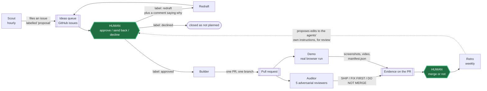

# Loop Dashboard

[](https://github.com/alessiopagliarulo/loop-dashboard/actions/workflows/ci.yml) [](LICENSE)

A control plane for a loop of autonomous Claude coding agents that propose, build, review, and demonstrate changes to real GitHub repositories — with a human approval gate in the middle.

**[Live demo → d1ougmzejkasx3.cloudfront.net](https://d1ougmzejkasx3.cloudfront.net)** · no login required · running on ECS Fargate behind CloudFront

[](https://d1ougmzejkasx3.cloudfront.net)

<sub>A LangGraph agent stopped at a checkpointed `interrupt()` on a real backlog. The model said *approve* at confidence 0.90; the human overrode it. Nothing is written until the graph is resumed. Receipts: [`docs/evidence/langgraph-run-2026-09-02.md`](docs/evidence/langgraph-run-2026-09-02.md).</sub>

---

Coding agents are cheap enough now that one can file a well-argued proposal every hour, around the clock. The bottleneck stops being *generating* work and becomes *triaging* it: a queue of plausible-looking issues, each of which takes a human ten minutes to evaluate, arriving faster than any human can read them. This project is the answer to that — a decision layer that turns a stream of agent output into a small number of high-quality decisions.

Nine agents run as GitHub Actions workflows in the target repository. The dashboard is where a person approves, rejects, or sends work back, and where the evidence for each decision is assembled before they look at it. It is a personal tool first: it runs against the author's own repos, on the author's own AWS account, for about **$11.50 a month**.

## Four results

**Dense embeddings beat the keyword baseline on duplicate detection — and the two encoders are indistinguishable, which is the useful finding.** Average precision 0.937 (MiniLM, local) and 0.934 (Titan V2 on Bedrock) against 0.760 for BM25, over 150 stratified pairs with 1,000-replicate bootstrap intervals. The two dense intervals overlap almost entirely, so the honest conclusion is not "Titan wins" but "keep the free local one." → [`docs/ml-results.md`](docs/ml-results.md)

**A model was killed by measuring the data first.** A proposal-acceptance classifier was planned and never built: all 24 human-authored PRs merged and all 26 rejections were bot PRs, so the model would have learned "was a human involved" and reported a false ~0.95 AUC. A second confound — the queue stalled on a known date, so "not merged" mostly meant "filed after triage stopped" — killed it independently. → [`docs/ml-results.md`](docs/ml-results.md)

**The human-in-the-loop gate is real, not decorative.** The LangGraph triage agent halts at a checkpointed `interrupt()` with `getState()` reporting `next: ["apply_decisions"]` and resumes from the checkpoint with human input. Verified over four live dry runs against eight open issues, with zero writes reaching GitHub; in one run human input changed 8 of 8 of the model's proposed actions. → [`docs/evidence/langgraph-run-2026-09-02.md`](docs/evidence/langgraph-run-2026-09-02.md)

**A signed-out visitor never reaches a route handler.** `proxy.ts` answers anonymous page loads and API reads from a frozen fixture set, so no GitHub token is ever in scope and no write path is reachable even in principle. `tests/lib/public-access.test.ts` pins the exact set of anonymously reachable endpoints, so widening that surface has to show up as a deliberate diff.

```console
$ curl -o /dev/null -w '%{http_code}\n' https://d1ougmzejkasx3.cloudfront.net/ideas
200

$ curl -o /dev/null -w '%{http_code}\n' -X POST \
    -d '{"action":"approve"}' https://d1ougmzejkasx3.cloudfront.net/api/ideas/1
403
```

**About the demo data:** it is a frozen snapshot of two real public repositories — real issues, pull requests, agent audits and metrics — not live data and not invented, and the banner on the page says exactly that. This is a single-owner tool pointed at private repositories, so the demo cannot show the live backlog. What is real is the application, the AWS infrastructure serving it, and the access-control mechanism deciding what a visitor is allowed to do.

## How it works



The human sits in exactly two places, and nothing crosses either without them: **nothing gets built until a person approves the idea**, and **nothing gets merged until a person merges it**.

**The dashboard is the decision layer; GitHub Actions is the execution layer.** They share no runtime and no database — state lives in GitHub issues, labels and pull requests, and four labels are the state machine (`proposal` → `approved` | `redraft` | `declined`). There is no Postgres, no SQLite, no Redis, no DynamoDB; grep the dependency tree and you will not find a database client. The cost of that is recorded next to the choice: no transactions, no concurrent-write safety, no querying, and GitHub's rate limits.

The nine agents, the Auditor's five role-specialised reviewers, and why Retro proposes changes to the loop's own instructions rather than making them: → [`docs/the-loop.md`](docs/the-loop.md)

## Architecture

```
Browser ──HTTPS──▶ CloudFront ──▶ ECS Fargate (arm64 Graviton, 1 task) ──Octokit──▶ GitHub API
                                        ▲   ▲
                    SSM SecureStrings ──┘   └── ECR   ◀── GitHub Actions (OIDC → STS, no stored keys)

signed caller ──SigV4──▶ Lambda Function URL ──▶ Bedrock (Titan V2)  +  S3 (content-addressed indexes)
```

All `us-east-1`. CloudFront instead of an ALB (an ALB alone would be ~$16.50/month, most of the bill); the origin security group admits only CloudFront's managed prefix list. Deployment is GitHub OIDC to a role whose trust policy names exactly one subject — one repository, one branch — so a fork, a tag or a pull request cannot assume it. Secrets are SSM SecureStrings injected through the task definition's `secrets` block, never `environment`. The inference Lambda has zero npm dependencies, signs its own SigV4 requests, and carries no managed IAM policies at all.

Why each piece is shaped that way, including what is deliberately **not** built (no ALB, no WAF, no alarms, no auto-scaling): → [`docs/aws-architecture.md`](docs/aws-architecture.md)

## Running it locally

Requires Node 22+ and npm. Nothing else — no database, no Docker, no AWS account.

```bash
git clone https://github.com/alessiopagliarulo/loop-dashboard.git
cd loop-dashboard
npm install
cp .env.example .env.local   # set DASHBOARD_PASSWORD and GITHUB_TOKEN

npm run dev      # http://localhost:3000
npm test         # 284 tests, no credentials needed — AWS and fs calls are mocked
npm run build    # standalone production build
```

`DASHBOARD_PASSWORD` can be anything long and random. `GITHUB_TOKEN` is a fine-grained PAT — not required to log in, but every page reads live GitHub data, so the dashboard is empty without one; `.env.example` lists the exact repository permissions, including the two that are easy to miss and fail confusingly when absent. Mac-only launcher features stay off unless `LOOP_DASHBOARD_LOCAL_MODE=1`, so a cloud deployment cannot expose them by accident.

### One-command launch on a Mac

```bash
scripts/launch-local.sh        # start (or reuse) the dashboard with real data and open it
scripts/launch-local.sh stop   # stop it
```

It installs dependencies only when `package-lock.json` changed, runs `next dev` on `http://localhost:3000` (so it always serves the code in the folder right now), and opens the browser. Running it again while it is up just opens the browser. Anything `.env.local` sets wins; what it lacks is filled in memory only, never on disk: `GITHUB_TOKEN` from `gh auth token`, and a one-run password that the script prints. The public demo is forced off, so the page asks for the password and then shows live data.

The ML pipeline, the LangGraph triage CLI, and the container build are in [`docs/running-locally.md`](docs/running-locally.md).

## Worth reading, if you are sampling rather than reading

- **[`docs/ARCHITECTURE.md`](docs/ARCHITECTURE.md)** — the long version of everything above, audited against the live AWS account rather than against the repo, with a section listing what is unfinished, what is wired but unused, and where the documentation had drifted from the code. Start here for depth.
- **[`docs/design-decisions.md`](docs/design-decisions.md)** — eleven architecture decisions with the rejected alternative and the accepted cost for each. The fastest way to tell whether the choices here were reasoned or accidental.
- **[`docs/ml-dedup.md`](docs/ml-dedup.md)** — the evaluation harness: stratified sampling with retained inclusion probabilities, why it refuses to run on an incomplete label file, why ties are never split in the PR curve, and why a synthetic-label smoke test scoring *well* would indicate a bug rather than a result.
- **[`docs/ml-artifacts-s3.md`](docs/ml-artifacts-s3.md)** — content-addressed artifact storage, and why the S3 loader falls back to a local copy while the Bedrock encoder deliberately refuses to fall back to MiniLM. One is a transport detail; the other would silently mislabel which model produced a number.
- **[`docs/audits/`](docs/audits/)** — two full defect registers from adversarial multi-agent audits of this system, including the one that found the loop's approval rate had been mis-reported as 0% for a month when the real figure was 35%.
- **Security fixes.** Three defects found and closed, with the reasoning in the commits and in decision #11: an authentication bypass on API routes ending in an image extension (`aac0fc6`), two LLM chat routes handing an unbounded filesystem to the model (`a57b95b`), and an authorization gate inverted into an amplifier (`e470f55`) — the mention workflow gated on the *comment author's* repository permission, which is sound when a person comments and useless when the dashboard does, because the dashboard's own token is an admin.
- **Tests.** 284 Vitest tests across the auth crypto, the public-access gate, the AI response parsing, the relay sanitiser, the LangGraph graph, the embedding backends and the duplicate detector — deliberately targeted at the security and parsing code rather than chasing coverage. A broken signature check is a security hole and a broken JSON parser silently corrupts every AI feature; both are pure functions with no network calls, so they are cheap to test.
- Three alternative UI directions are rendered as static pages in [`docs/mockups/`](docs/mockups/).

## Tech stack

**Application** — TypeScript, Next.js 16 (App Router), React 19, Tailwind CSS v4, Octokit. About 64,900 lines of TypeScript/TSX in the repo, of which ~22,100 is generated demo fixture data and ~4,200 is tests — roughly 38,600 hand-written application lines across 73 API routes. Note that in Next.js 16 the request interceptor is `proxy.ts`, not `middleware.ts`.

**AI / ML** — Claude via three interchangeable backends (local CLI, Anthropic API, Bedrock) behind one call interface; LangGraph.js for the human-in-the-loop triage graph; transformers.js with `all-MiniLM-L6-v2` for local embeddings; Amazon Bedrock Titan Text Embeddings V2 for the hosted comparison.

**AWS** — ECS Fargate, ECR, CloudFront, Lambda, S3, Bedrock, SSM Parameter Store, IAM (including GitHub OIDC federation), CloudWatch Logs.

**Infrastructure & tooling** — Docker (multi-stage, arm64), GitHub Actions, Vitest, ESLint, `gh` CLI, Playwright.

## A note on what this repo claims

Every number here traces to a file or a command you can run. Where something is measured, the interval is reported next to it. Where something is confounded, the confound is named and its scope stated. Where something is planned but not built — alarms, a load balancer, multi-tenancy — it is listed as not built.

The unglamorous findings are in here on purpose: an evaluation that could not separate two models, a model that was never built because the data had a leak in it, a task count pinned to one by in-memory state. They are the parts most likely to be true.

## License

MIT — see [`LICENSE`](LICENSE).
