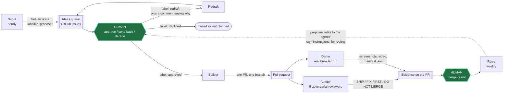

# The loop, and how the two halves are split

> Extracted from the README so the front page stays short. This is the long
> version of what the nine agents are and why the dashboard has no database.

## The nine agents

The human sits in exactly two places, and nothing crosses either without them: **nothing gets built until a person approves the idea**, and **nothing gets merged until a person merges it**. Every agent action either produces something for a human to judge or acts on a judgement a human already made.

The nine agents:

| Agent | Trigger | What it does |
|---|---|---|
| **Scout** | hourly | Researches the market and the codebase, files new ideas as issues labelled `proposal`. Never writes code. Stops filing when the open queue hits a configurable cap. |
| **Redraft** | `redraft` label | Rewrites an idea to match the feedback comment and puts it back in the queue. |
| **Builder** | `approved` label, 30-min backstop | Picks the strongest idea and opens exactly one PR from a `claude/` branch. |
| **Auditor** | loop PRs | Spawns five adversarial reviewers, posts one verdict comment. |
| **Demo** | loop PRs | Boots the app, drives it in headless Chromium, uploads screenshots and video. |
| **Retro** | weekly | Reviews what got approved, ignored, or merged; proposes edits to the loop's own instructions. |
| **Metrics** | daily, every PR | Plain reporting job, no AI. Writes the numbers up. |
| **@mention** | `@claude` in any comment | Wakes an agent from the GitHub phone app. The remote control. |
| **Tool installer** | dashboard event | Wires a newly requested tool or skill into the right workflow. |

**Only loop PRs wake the Auditor and Demo.** A loop PR is one the Builder opened: a `claude/` branch in the repo, authored by the loop's own identity (the same author test the in-flight detection below uses). The owner's hand-made PRs, including ones from their own Claude Code sessions that also name a branch `claude/...`, get only the plain CI checks; the agent runs show as skipped, not failed. Every agent run spends the owner's Claude subscription, so nothing but approved ideas goes through the loop. Either agent can still be run on any PR by hand with `workflow_dispatch`.

**The Scout, Redraft and Builder read the work in flight first.** The owner also builds things by hand, and the loop kept proposing — and once or twice building — what was already sitting on a branch or merged last week. So before any of the three acts, `scripts/loop-inflight.mjs` (installed from `config/loop-template/files/`) gathers every open PR including drafts, every branch pushed recently without a PR, recent merges, and every idea already filed or closed. A deterministic backstop then flags an idea `covered` — with a link — when a person's work names it, or when the same MiniLM duplicate detector the Ideas page uses scores it as the same request. It flags; it never closes. The owner's side of the bargain is one habit: push local work early, ideally as a draft PR. Full contract: `DASHBOARD-CONTRACT.md` §8.

Two details worth knowing, because the obvious guess about each is wrong:

**The Auditor's five reviewers are role-specialised, not five copies of the same prompt.** They are Correctness ("trace the logic, find the bug"), Regression ("what breaks — check every caller and import"), Security ("secrets, injection, authz, unsafe deps, exposed endpoints"), Tests ("name the failing case this PR misses"), and Simplicity ("dead code, duplication, over-engineering"). They run as blocking subagents in one message; the parent verifies each finding itself before posting a single SHIP / FIX FIRST / DO NOT MERGE verdict. This is where tokens are deliberately spent.

**Retro proposes, it does not rewrite.** It cannot edit `.github/workflows/` — the Actions `GITHUB_TOKEN` has no `workflow` scope, so GitHub rejects the push outright, and those files are copies of a shared template that would be overwritten anyway. So Retro opens one issue summarising the week and, only when there is a genuinely repeated lesson, one PR appending dated lines to `LEARNINGS.md` and a structured suggestion (workflow file, exact current wording, proposed diff, rationale) to `docs/loop-suggestions.md`. A human applies it through the dashboard's template editor. The system proposes changes to its own instructions; it does not make them.

---

## How it works

The split is the whole design. **The dashboard is the decision layer. GitHub Actions is the execution layer.** They share no runtime and no database.

The nine workflows live in the *target* repository's `.github/workflows/`, maintained here as an editable template under `config/loop-template/workflows/`. They run on GitHub's runners with GitHub's own credentials. The dashboard never executes agent work; it reads state, presents decisions, and writes labels.

### There is no database

State lives in GitHub issues, labels, and pull requests. There is no Postgres, no SQLite, no Redis, no DynamoDB — `grep` the dependency tree and you will not find a database client.

Four labels are the state machine: `proposal` → `approved` | `redraft` | `declined`. Approving an idea is one API call that *replaces* the issue's queue label rather than adding and removing in two steps, which avoids a window where the dashboard and the Builder read different states. That label write is itself the trigger: `claude-builder.yml` listens on `issues: labeled`. A `workflow_dispatch` call is made only in the one case where GitHub would not fire an event anyway — re-applying a label the issue already has.

This is a deliberate trade, and the cost is recorded next to it: no transactions, no concurrent-write safety, no querying, and GitHub's API rate limits. The data is small, naturally versioned, human-readable, and already lives where the work happens. Git gives history and rollback for free. The choice stops working the moment there are multiple users — which is exactly why multi-tenancy is deferred rather than half-built.

Decisions like this one are logged in [`docs/design-decisions.md`](design-decisions.md) — what was decided, why, what was rejected, and what the accepted tradeoff was. It is the fastest way to tell whether the choices in this repo were reasoned or accidental.
